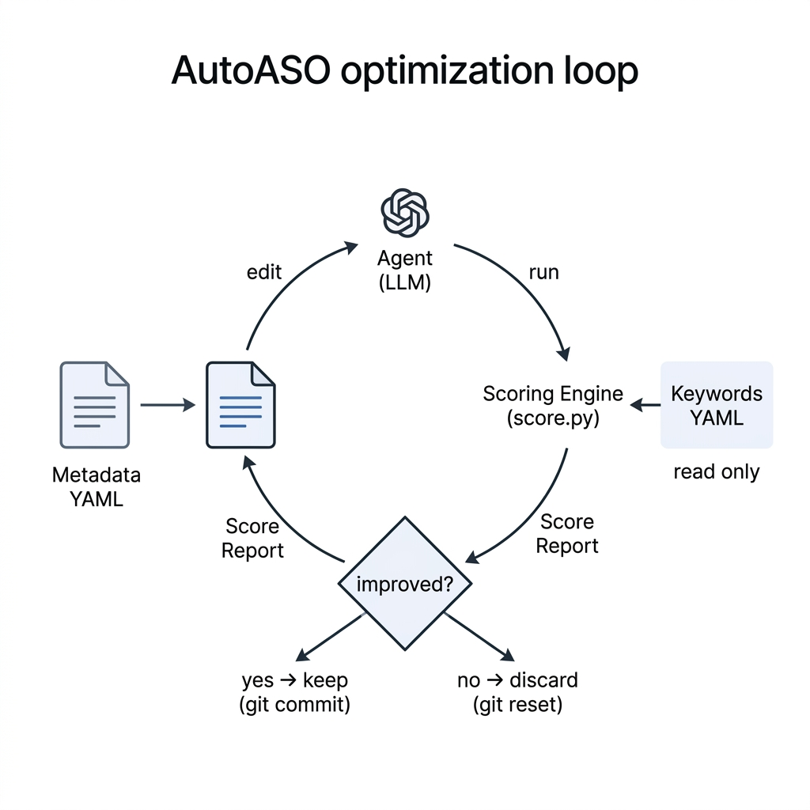

# AutoASO

Autonomous App Store Optimization. An agent that iteratively improves app store metadata — titles, subtitles, and keyword fields — by running continuous experiments against a composite scoring engine.

Inspired by [Karpathy's autoresearch](https://github.com/karpathy/autoresearch), which applies the same loop to ML hyperparameter search. AutoASO replaces the training script with an ASO scoring function and replaces the model weights with app metadata.

---

## Architecture

<p align="center">
  
</p>

The agent follows a fixed protocol:

1. Read the current metadata and the last score breakdown.
2. Identify the weakest scoring component.
3. Form a hypothesis — one targeted edit to improve that component.
4. Make the edit to the metadata YAML file.
5. Validate character limits (iOS: 30/30/100, Google Play: 30/80/4000).
6. Run the scoring engine.
7. If the score improved, keep the change (`git commit`). If not, discard it (`git reset --hard`).
8. Log the result and repeat.

The agent runs indefinitely until manually stopped or until 20 consecutive experiments yield no improvement.

---

## How the Scoring Engine Works

`score.py` computes a composite score out of 100, broken into 7 weighted components. The agent is forbidden from modifying this file — it can only edit the metadata.

| Component | Weight | What It Measures |
|---|---|---|
| Keyword Coverage | 25% | What percentage of target keywords appear anywhere in the metadata, weighted by tier (NorthStar keywords count 4x more than tertiary). |
| Placement Accuracy | 25% | Whether keywords are in their ideal fields. A NorthStar keyword in the title scores higher than the same keyword buried in the keyword field. |
| Character Efficiency | 15% | How much of the character budget is used, minus a penalty for dead-weight words ("amazing", "best", "top", etc.) that waste space without ranking signal. |
| Phrase Coverage | 10% | Whether multi-word keyword phrases appear as complete, contiguous phrases rather than individual words scattered across fields. |
| Duplication Penalty | 10% | Penalizes words that appear in both the keyword field and the title/subtitle. On iOS, Apple ignores duplicates — they are wasted characters. |
| NorthStar Defense | 10% | Binary check: each NorthStar keyword must appear in the title or subtitle. If even one is missing, you lose points. |
| Semantic Naturalness | 5% | Heuristic readability check. Penalizes all-caps words, excessive separators, and truncation artifacts. |

### The 3D Keyword Framework

Keywords in `keywords/*.yaml` are organized into tiers:

- **NorthStar** — The category-defining terms your app must own. These carry 4x weight in the scoring engine.
- **Primary** — High-volume, high-intent phrases. Target: title, subtitle, or keyword field.
- **Secondary** — Mid-volume phrases for the keyword field and descriptions.
- **Tertiary** — Long-tail terms to pack remaining character budget.

Each keyword also carries `volume` (search popularity) and `difficulty` (competition) metadata for strategic decisions.

---

## Can This Actually Work?

This is a fair question. Here is the honest answer.

**What AutoASO does well:**
The scoring engine models the *metadata quality* portion of App Store ranking. Apple's documentation confirms that the title carries more indexing weight than the subtitle, which carries more than the keyword field. The engine encodes these relationships. It also enforces real constraints: character limits, deduplication rules, and dead-weight detection. Running 100+ experiments per hour against these constraints will produce objectively better metadata than manual optimization.

**What AutoASO does not model:**
The App Store ranking algorithm factors in download velocity, ratings, retention, engagement, and revenue. These are not part of the scoring engine because they are not controllable through metadata alone. AutoASO optimizes the controllable surface — the words — and leaves the behavioral signals to the product itself.

**Can we replicate the full App Store algorithm?**
Not exactly, but we can get meaningfully close for the metadata layer. Apple does not publish their ranking algorithm, but the community has reverse-engineered the key signals through years of A/B testing. The known facts:

- Title keywords are indexed with highest priority
- Subtitle keywords are indexed second
- Keyword field is indexed but with lower weight
- Duplicate words across fields are ignored (iOS)
- Long descriptions are NOT indexed on iOS (but are on Google Play)
- Download velocity within 24-72 hours of a metadata change affects ranking

A V2 of this project could add a **simulated ranking model** that estimates keyword rank positions based on metadata placement, historical difficulty scores, and competitor density. That would get closer to a true App Store algorithm proxy. The current V1 focuses on getting the metadata itself right.

**Industry benchmarks for iterative metadata optimization suggest a 30-60% increase in organic installs.**

---

## Project Structure

```
score.py              — Scoring engine (read-only for the agent)
program.md            — Agent instructions and experiment loop protocol
requirements.txt      — Python dependencies (pyyaml only)

keywords/             — Keyword definition files (read-only for the agent)
  kids_focus_ios_us.yaml

metadata/             — Metadata files (the ONLY files the agent edits)
  kids_focus_ios_us.yaml

results/              — Experiment logs in TSV format
  kids_focus_ios_us.tsv

utils/
  report.py           — Experiment progress report generator

assets/
  architecture.png    — Architecture diagram
```

---

## Quick Start

### Install dependencies

```bash
pip install -r requirements.txt
```

### Run the scorer on baseline metadata

```bash
python score.py \
  --metadata metadata/kids_focus_ios_us.yaml \
  --keywords keywords/kids_focus_ios_us.yaml
```

Example output:

```
---
total_score:      55.01
coverage:         40.98
placement:        28.74
efficiency:       84.33
phrase_coverage:  40.98
duplication:      8.33
northstar:        66.67
naturalness:      100.00
platform:         ios
locale:           us
char_usage:       title=24/30  subtitle=27/30  keyword_field=83/100
```

### Run the agent

Point any autonomous coding assistant (Claude Code, Cursor Agent, GitHub Copilot Workspace, or a custom LLM runner) at the project with this prompt:

> Read `program.md` and start executing the optimization experiment loop for kids_focus/ios/us.

The agent will begin iterating. Each experiment takes under 2 seconds.

### View experiment history

```bash
python utils/report.py
```

```
═══════════════════════════════════════════════════════
  AutoASO — Experiment Report
═══════════════════════════════════════════════════════

───────────────────────────────────────────────────────
  App:         kids_focus_ios_us
  Experiments: 7 total | 6 kept | 1 discarded | 0 crashed
  Baseline:    55.01
  Best score:  76.66  (+21.65)
───────────────────────────────────────────────────────
```

---

## Adding a New App

1. Create `keywords/yourapp_platform_locale.yaml` with your keyword tiers, volumes, and difficulty scores.
2. Create `metadata/yourapp_platform_locale.yaml` with your current live metadata as the baseline.
3. Create an empty `results/yourapp_platform_locale.tsv` with the header: `commit	total_score	status	description`
4. Run: `python score.py --metadata metadata/yourapp_platform_locale.yaml --keywords keywords/yourapp_platform_locale.yaml`
5. Point the agent at `program.md` with the new target specified.

---

## Roadmap

- **V1 (current)** — Local scoring engine with manual keyword lists. iOS and Google Play support.
- **V2** — Simulated keyword ranking model that estimates rank positions based on placement, volume, and difficulty.
- **V3** — API integration for live keyword data (AppFollow, AppTweak, or SensorTower) to auto-populate keyword tiers.
- **V4** — Multi-locale optimization across Tier 1/2/3 markets with locale-specific keyword sets.

---

## Acknowledgements

- [autoresearch](https://github.com/karpathy/autoresearch) by Andrej Karpathy — the core pattern of an autonomous agent running a fixed scoring loop with edit/score/keep/discard logic is directly adapted from this project.
- [autoresearch-mlx](https://github.com/mzbac/autoresearch-mlx) by mzbac — the Apple Silicon native fork that demonstrated the pattern works outside of CUDA environments.
- The ASO community and practitioners whose published research on keyword indexing, field weighting, and character optimization informed the scoring weights in `score.py`.

---

## License

MIT
